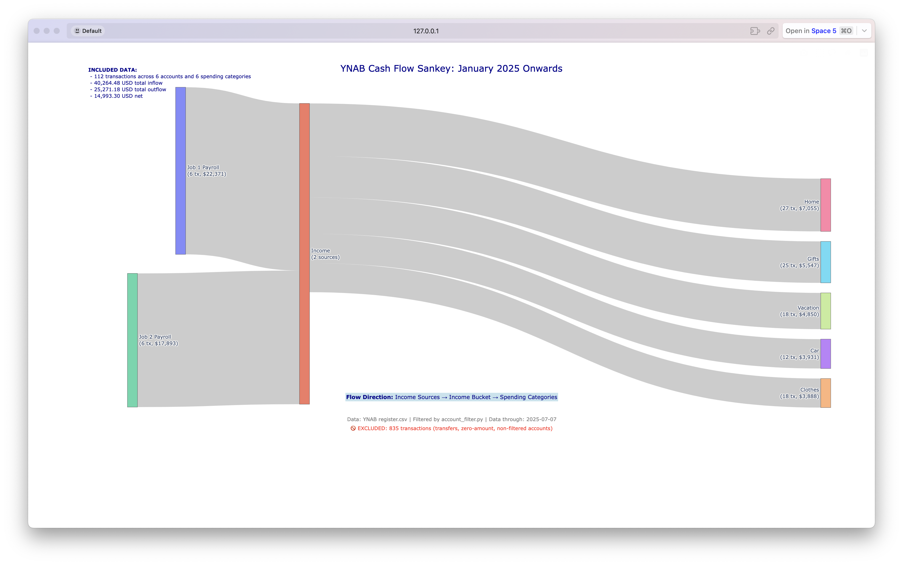

# YNAB Sankey Diagram Generator

This project creates Sankey diagrams from your YNAB (You Need A Budget) transaction data, showing the flow of money from income sources through to spending categories.



## What is a Sankey Diagram?

A Sankey diagram is a type of flow diagram that shows the movement of quantities (in this case, money) between different categories. The width of each flow represents the amount of money, making it easy to visualize where your money comes from and where it goes.

## Features

- **Income Flow Visualization**: See all your income sources flowing into a central "Income" bucket
- **Spending Category Analysis**: Track how money flows from income to different spending categories
- **Account Filtering**: Include only the accounts you want to analyze
- **Interactive Charts**: Hover over flows to see transaction counts and amounts
- **Date Filtering**: Focus on specific time periods
- **Transfer Exclusion**: Automatically excludes internal transfers between accounts

## Prerequisites

- Python 3.7 or higher
- A YNAB account with transaction data
- Basic familiarity with Python and CSV files

## Installation

1. **Clone or download this repository**
   ```bash
   git clone <repository-url>
   cd ynab-sankey
   ```

2. **Install Python dependencies**
   ```bash
   pip install -r requirements.txt
   ```

## Getting Your YNAB Data

### Step 1: Export from YNAB

1. Log into your YNAB account at [app.youneedabudget.com](https://app.youneedabudget.com)
2. On the budget you want to export, select "Export Plan" from the main menu

### Step 2: Prepare Your Data

1. Move the `register.csv` into the `ynab_data/` folder in this project
2. The file should have columns like: `Account`, `Date`, `Payee`, `Category Group`, `Outflow`, `Inflow`, etc.

## Configuration

### Account Filtering

Sometimes you won't want to include all accounts in your Sankey. This is easily configurable with the `account_filter.py` file. This file controls which accounts are included in your analysis:

```python
account_filter = {
    "Checking Account": True,    # Include this account
    "Savings Account": False,    # Exclude this account
    "Credit Card": True,         # Include this account
    # ... add all your accounts
}
```

#### Automatically Generate `account_filter.py`

You can automatically generate the `account_filter.py` file from your YNAB register export using the provided script. This is especially useful if you have many accounts or want to ensure all accounts are listed:

```bash
python get_accounts.py ynab_data/register.csv
```

- This script will scan your `register.csv` and create (or overwrite) `account_filter.py` with all unique accounts set to `True` by default.
- Edit the generated `account_filter.py` to set `False` for any accounts you want to exclude from the analysis.
- The script uses [pandas](https://pandas.pydata.org/) for robust CSV handling (already included in `requirements.txt`).

#### Manually Configure

1. Open `account_filter.py`
2. Find the `account_filter` dictionary
3. Set `True` for accounts you want to include, `False` for accounts to exclude

#### Tips for account filtering

- Include checking accounts, credit cards, and cash accounts you use for daily spending
- Exclude investment accounts, retirement accounts, and savings accounts (unless you want to track transfers to/from them)
- Exclude accounts that are primarily for transfers between other accounts

### Date Range

The date range of what's included in the Sankey is controlled by the `start_date` variable:

```python
start_date = pd.to_datetime('2025-01-01')
```

## Usage

1. **Place your YNAB data** in `ynab_data/register.csv`
1. **Generate your account filter** (optional, but recommended for new data):
   ```bash
   python get_accounts.py ynab_data/register.csv
   ```
1. **Configure your accounts** (see Configuration section above)
1. **Run the script**:
   ```bash
   python ynab_sankey.py
   ```
    The chart should automatically open for your review in your web browser.

The script will:
- Load and filter your transaction data
- Create a Sankey diagram showing money flow
- Display statistics about included/excluded transactions
- Open an interactive chart in your browser

## Understanding the Output

### The Sankey Diagram

The diagram shows three main sections:

1. **Left side**: Income sources (who paid you money)
2. **Center**: Income bucket (aggregated income)
3. **Right side**: Spending categories (where you spent money)

### Statistics Displayed

- **Included Data**: Number of transactions, accounts, and categories analyzed
- **Total Inflow/Outflow**: Total money coming in and going out
- **Net Flow**: Difference between inflow and outflow
- **Excluded Data**: Number of transactions filtered out (transfers, zero amounts, etc.)

### Node Labels

Each node shows:
- **Income sources**: `Source Name (X tx, $Y,YYY)` - shows transaction count and total amount
- **Income bucket**: `Income (X sources)` - shows number of income sources
- **Spending categories**: `Category (X tx, $Y,YYY)` - shows transaction count and total amount

## Customization Options

### Changing the Chart Title

Edit line 140 in `ynab_sankey.py`:

```python
title_text=f"YNAB Cash Flow Sankey: {start_date.strftime('%B %Y')} Onwards"
```

### Adjusting Chart Height

Edit line 145 in `ynab_sankey.py`:

```python
height=800  # Increase or decrease this value
```

### Modifying Date Format

Change the date format in the title by modifying the `strftime` format string.

## Troubleshooting

### Common Issues

1. **"File not found" error**
   - Make sure `register.csv` is in the `ynab_data/` folder
   - Check that the filename is exactly `register.csv` (case sensitive)

2. **Empty chart or no data**
   - Verify your account filter settings in `account_filter.py`
   - Check that your date range includes transactions
   - Ensure your CSV file has the expected column names

3. **Column name errors**
   - YNAB may export different column names depending on your settings
   - Check the first line of your CSV file to see the actual column names
   - Update the script if needed to match your column names

4. **No transactions shown**
   - All accounts might be set to `False` in `account_filter.py`
   - Your date range might be outside your transaction dates
   - All transactions might be transfers (which are excluded)

### Data Format Issues

If your YNAB export has different column names, you may need to modify the script. The expected columns are:
- `Account`
- `Date`
- `Payee`
- `Category Group`
- `Outflow`
- `Inflow`

## Example Output

The script generates an interactive Sankey diagram showing:
- Income flowing from various sources (jobs, side hustles, etc.)
- Money flowing from the income bucket to spending categories
- Transaction counts and amounts for each flow
- Comprehensive statistics about your financial data

## Contributing

Feel free to submit issues, feature requests, or pull requests to improve this project!

## License

This project is open source. Feel free to use and modify for your personal financial analysis.

---

**Note**: This tool is for personal financial analysis only. Always review your data and ensure it matches your expectations before making financial decisions based on the visualizations.